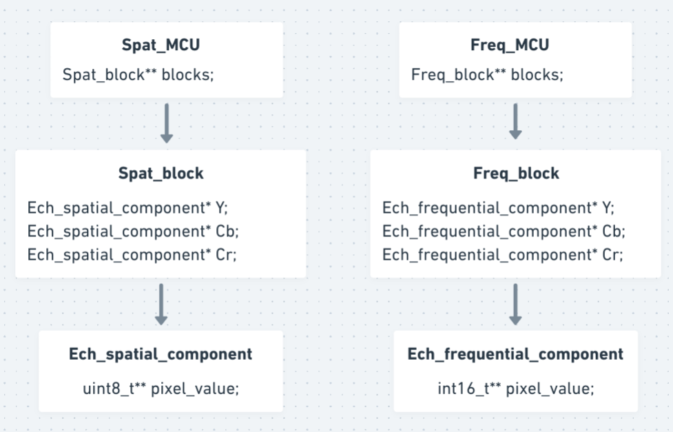

# Encodeur JPEG

Encodeur en C convertissant des images de format .ppm ou .pgm, en format compressé jpeg.

Fonctions optimisées pour une éxécution rapide. (Utilisation de la Loeffler-DCT, symboles de huffman précalculés...).

Réalisé dans le cadres d'un projet de fin d'année de l'ENSIMAG.

## 🔧 Tester le programme

### Compilation

```shell
make
```

### Exécution

```shell
./ppm2jpeg image.ppm
```

Paramètres optionnels :

* ```--help``` pour afficher la liste des options acceptées ;
* ```--outfile=sortie.jpg``` pour redéfinir le nom du fichier de sortie ;
* ```--sample=h1xv1,h2xv2,h3xv3``` pour définir les facteurs d'échantillonnage hxv des trois composantes de couleur.

<br/>

## 🗂️ Répartitions en modules :


**Gestion des arguments (handle_args.c)**

* Interface utilisateur, gestion des interactions entre l'utilisateur et le programme.

**Lecture du fichier source PPM/PGM. (read_ppm.c, mcu.c)**

* Lecture des données du fichier, convertion RGB en YCbCr, découpage des MCUs et sous-echantillonage. 

Structure d'une MCU :



<br/>

 **Encodage (encode.c, dct.c, huffman.c, qtables.c, htables.c)**

* Encodage des blocks : DCT (Chen-DCT ou Loeffler-DCT), réorganisation en zig-zag, quantification, codage RLE, codage par différence et codage de Huffman.


**Ecriture dans le fichier de sortie (write_jpeg.c, buffer.c)**

* Écriture de l'en-tête JPEG, écriture du bitstream dans le fichier de sortie.
